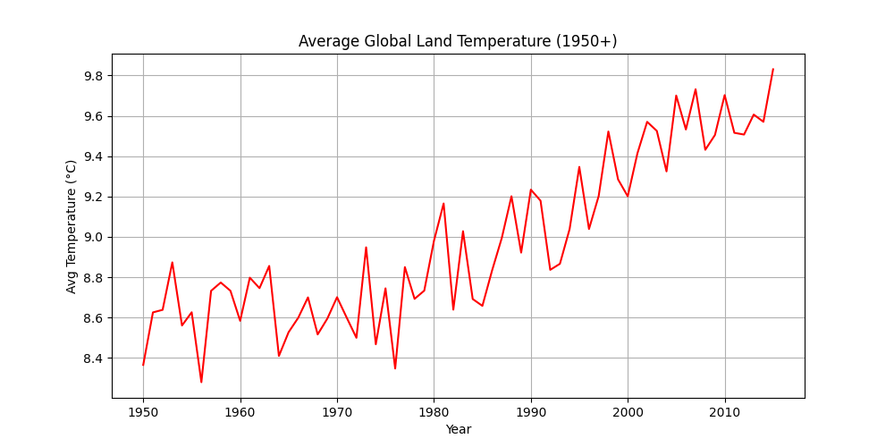

# 🌍 Climate Trend Analysis (1950 - Present)

This project analyzes the rise in **global average land temperature** from **1950 to the present** using real historical data. The dataset is sourced from Kaggle, and the analysis is done using Python (Pandas + Matplotlib).

---

## 📁 Files Included

| File | Description |
|------|-------------|
| `GlobalTemperatures.csv` | Raw dataset from Kaggle |
| `climate_analysis.ipynb` | Jupyter Notebook with complete code and output |
| `temperature_trend.csv` | Filtered + grouped data (yearly average temperatures) |
| `temperature_plot.png` | Final line plot visualization |
| `README.md` | This file – project overview and details |

---

## 📊 Temperature Trend Graph

---

## ⚙️ Tools Used

- Python 🐍
- Pandas 🐼
- Matplotlib 📈
- Jupyter Notebook 📓

---

## 🧪 Steps Performed

1. Imported global land temperature dataset
2. Cleaned the data and removed null values
3. Converted date column to datetime format
4. Filtered data from year 1950 onwards
5. Calculated yearly average temperatures
6. Created a line graph to visualize trends
7. Saved cleaned data and chart to files

---

## 📌 Conclusion

This analysis shows a clear **rising trend in global land temperatures** since 1950, reflecting the impact of climate change over the decades. This project demonstrates basic data cleaning, filtering, grouping, and visualization using Python.

---

## 🧠 Author

Made with ❤️ by **Yasir Ali**  
📌 HSC Computer Science Student | Aspiring Data Scientist  
🔗 GitHub: [yasirali-datasci](https://github.com/yasirali-datasci)

---

## 🔖 Tags

`climate-change` `data-analysis` `pandas` `matplotlib` `jupyter` `python-project` `temperature-trend`

